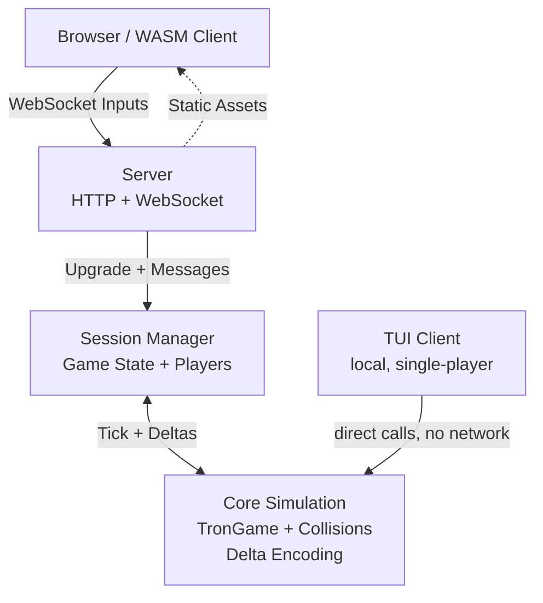

# Snake
A real-time multiplayer/single-player snake game collection. Started as a terminal implementation of classic Snake, with plans to grow into 3 variants: Classic, Tron, and Battle Royale.

>**DISCLAIMER**
*AI helped me in the process of learning zig and its idioms and as a sounding board for ideas and talk through my designs and mental model. AI did NOT write the code other than the client side because I didn't care as long the game was playable nor do I care about frontend development.*

## Quick Start
```bash
  git clone https://github.com/ree-see/snake.git
  cd snake

  zig build -Doptimize=ReleaseSafe   # build everything in release mode
  zig build server                   # http://localhost:8080/
  zig build classic                  # run the tui
```
## Features
- Built with Zig 0.16 using a data-oriented design approach
- Frontend-agnostic: any client that speaks the websocket protocol (or links the WASM binary) can talk to the Zig core
**Core Simulation**: Platform-agnostic game logic with collision detection, multi-snake support, and efficient binary encoding

**TUI**: A simple terminal client in raw mode with Unicode and ANSI rendering

**Multiplayer server**: Websocket-based, hand-rolled with no framework, supporting concurrent sessions and connections

**WASM**: For web play *(classic mode only, for now)*

## Architecture
```text
src/
├── core.zig          # Pure simulation (reusable across frontends)
├── tui.zig           # Terminal client
├── server.zig        # HTTP + WebSocket server
├── session.zig       # Game sessions & player management
├── websocket.zig     # Low-level protocol helpers
└── wasm.zig          # Browser export

web/                  # Static HTML/JS/CSS frontend
```	


### Key Decisions

### `TronGame.snakes`
`TronGame` started as an AoS (Array of Structures) design and moved to SoA (Structure of Arrays).

Why though?

For a game with 5 snakes, pulling in `std.MultiArrayList` looks like overkill but my north star is a battle royale variant with 100 snakes.
>The idea came from a data-oriented design talk by the Zig creator, Andrew Kelley ([A Practical Guide to Applying Data Oriented Design (DoD)](https://youtu.be/IroPQ150F6c?si=K9GJr_tQXPkbufAm)), where he covers how he and the Zig team measurably cut compile times — up to 39% less wall-clock time (and 53% fewer cache misses) in one pipeline stage, and 22% less wall-clock time in another — with two techniques. Oversimplified:  **1)** Being conscious of how struct fields are laid out in memory, with respect to cache lines.  **2)** Using SoA via `std.MultiArrayList` so you can iterate over a single field of a struct without touching the rest.

  After watching that talk, I realized the battle royale variant will loop over `n_snakes` (≤ 100) every frame to detect collisions and deaths. In each collision check, I was pulling in the entire `Snake` struct just to read `Snake.is_dead`, when a SoA layout lets me iterate a plain slice of `is_dead` values instead, with the index identifying which snake it belongs to.

  With AoS, 5 snakes at ~32 bytes each pulls ~160 bytes into L2 cache per iteration. With SoA, iterating just `is_dead` touches a `[5]bool` 1 byte each (with padding) so 5 bytes total, no cache misses. This is admittedly premature, and not something I'd ship to production without benchmarks proving a net win, because `std.MultiArrayList` isn't free:

1) Productivity cost: every place I accessed a snake field through `TronGame`, I now need the boilerplate `const s = snakes.slice(); const <field> = s.items(.<field>);` (see example below).

2) `TronGame.snakes` now lives on the heap, managed by `std.MultiArrayList`.

```zig
for (snakes) |snakes| {
  if (snake.is_dead)
  ...
}
// to
const s = snakes.slice();
const dead = s.items(.is_dead);

for (dead) |is_dead| {
  if (is_dead)
  ...
}
```
 
```zig
const TronGame = struct {
  snakes: [n_snakes]Snake
  ... // other fields
}
                                    // [5]Snakes {
# with SoA design                   //     is_dead: [5]bool,
const TronGame = struct {           //     kills: [5]u8,
  snakes: std.MultiArrayList(Snake) //     direction: [5]Direction,
  ... // other fields               //     body: std.ArrayList(Position),
}                                   //}                                    
```

### Concurrent and Network Design
**From-Scratch HTTP and Websocket Server**: I'd never implemented an HTTP server in any language, so I wanted to challenge myself no framework, manual thread management. With AI as a partner for understanding the plumbing, I implemented a basic HTTP server and the websocket protocol myself. This is not a production-ready server: I have basic path traversal protection, input sanitization, and game-specific websocket messaging. Plenty of edge cases are left unhandled, since the goal was understanding the fundamentals of HTTP and websockets, not building something production-grade.

**Concurrency Design**: A client connects to the server and spawns a thread per connection. The session manager then assigns the client to a session, and each session also runs on its own thread so there's a main thread, one thread per client, and one thread per session. That means state has to be managed safely: I used a mutex on the session manager and on each session, since the main thread reads/mutates sessions in the session manager while clients concurrently mutate their message queues. This was the hardest part. I'd never implemented multithreaded concurrency myself before this project.

## Implementation Journey
- When implementing the multithreaded concurrency design, I tried (`src/session.zig` lines 519-547) using tests to catch race conditions, as one naive developer would do. Then I realized testing for race conditions is very tricky even before adding mutex locks, the test was passing. I probably ran the test 1000-2000 times trying to trigger a race condition. I never got one, but that doesn't mean it wasn't possible.

- I had always shied away from manually memory-managed languages, because my programming journey started with Python for data science. Even with Rust, you aren't really managing memory, you state lifetimes and annotate them, but you don't manually say "alloc now" or "free this once done." I've gained an appreciation for manual memory management, and I love the control it gives.

- Naively, I originally designed the sessions to use arena allocators, but realized that wasn't the right tool for what I needed:

**(1)** *a session has shared state between two external actors, which isn't great for arenas*

**(2)** *if you're careful with your init and deinit methods, you don't really need them*

As long as you propagate the memory management up through the higher-order structs snakes are initialized and freed by the game, games by sessions, sessions by the session manager, and the session manager by `main` you get the same guarantees without arena overhead.

## Roadmap
- Basic bot for demos and testing
- Battle royale variant
- Full browser client wasm support
- More testing

## Tech Stack
- Zig 0.16
  - Why?
    - Initial reasoning was I thought it was interesting especially the new IO interface
      - one gripes I had with rust was how crazy rust gets once you hit async and concurrency in rust. Zigs take on the IO interface was pleasing and easier to use than rust and tokio.
    - Some zig contributor I follow explained zig very well
  Paraphrasing: "*C I can do anything but I can shoot myself in the foot. I want with rust I have to write a dissertation just to experiment some things. Zig is that perfect middle ground.*"
