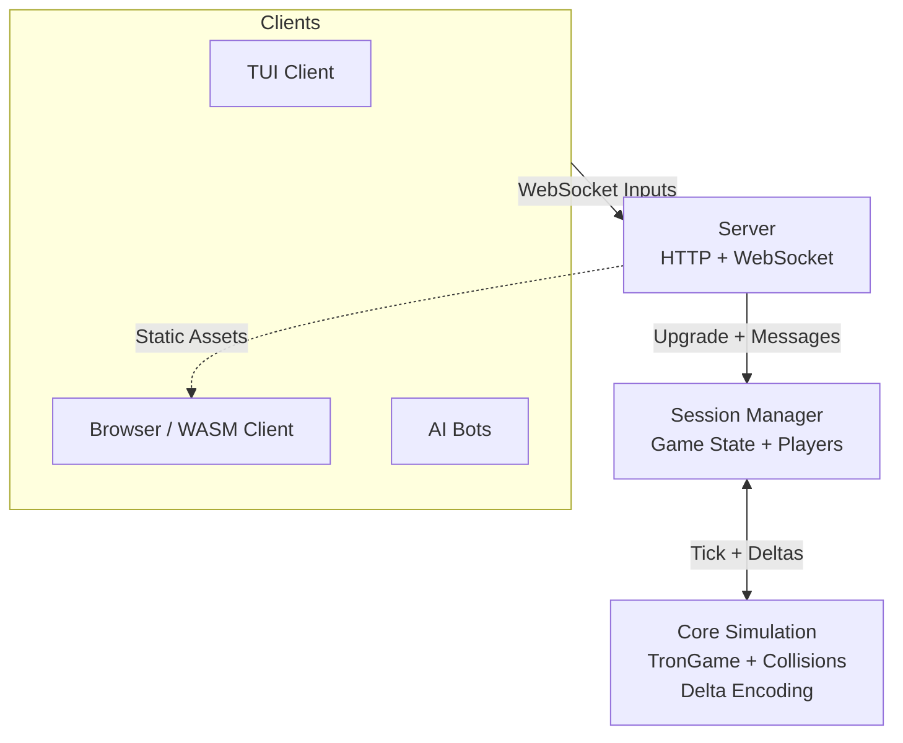

# Snake
  A real-time multiplayer/single player snake game collection. Started as an implementation of the classic Snake game in the terminal to eventually 3 snake game variants:Classic, Tron, Battle.
  
![DISCLAIMER]
```
  How I used AI in this project:
    - The zig codebase was written by me. I am not a fronend/web developer nor do I care about as long as it looks good it was fine with me to use it for the frontend client side code.
    - Zig specific syntax or std library questions were asked to ai and as a bouncing board to talk through the design of the simulation and structure for the zig codebase
```
## Quick Start
```bash
  git clone https://github.com/ree-see/snake.git
  cd snake
  # to build the codebase
  zig build
  
  # to start the http server
  # open browser and navigate to localhost:8080
  zig build -Doptimize=ReleaseSafe server

  # to start the tui snake version
  zig build classic
```
## Features
**Core Simulation**: Platform agnostic game logic with collision detection, multi-snake support, and efficient binary encoding
**TUI**: a simple terminal client in raw mode with unicode and ANSI rendering
**Multiplayer server**: websocket based with concurrent sessions and connections raw dawgd
**WASM** for web play *only for classic mode*

- Used modern zig version 0.16 with a data oriented design approach
- extensible in the sense that the frontend code doesn't matter as long as you understand the websocket messaging or able to use the wasm bin to talk to the zig codebase

## Architecture
```
src/
├── core.zig          # Pure simulation (reusable across frontends)
├── tui.zig           # Terminal client
├── server.zig        # HTTP + WebSocket server
├── session.zig       # Game sessions & player management
├── websocket.zig     # Low-level protocol helpers
└── wasm.zig          # Browser export

web/                  # Static HTML/JS/CSS frontend
```	


### Key Decisions

### `TronGame.snakes`
Initially the TronGame struct was an AoS (Arrays of Structures) design to a SoA (Sturcture of Arrays).

Why though?
You may be thinking for a game with 5 snakes there's no need to pull in `std.MultiArrayList` but my north star for this is a battle royale variant with 100 snakes. This idea came straight from a talk about data oriented design by the zig creator himself, Andrew Kelly. He goes through how he and the zig team increased compilation times by ~50x by using to two techniques. To oversimplify the talk:

1) being consicious of designing the fields on struct and how they align in memory with respect to cache memory

2) utilizing SoA via `std.MultiArrayList` to just iterate over just a one field of a struct.  

So after watch this talk I realized when this game gets the battle royale variant I will be looping over nsnakes where `nsnakes` <= 100 every frame to detect collisions and deaths. In each collision check and applying deaths and snakes next position, I was accessing the entire Snake struct just to access `Snake.is_dead` whereas in a SoA design I can just iterate over a slice a of `is_dead` fields and the index is what keeps track of which snake is dead.
SoA the memory being put into L2 cache was ~32 bytes per snake so 5 * 32 bytes = 160 bytes but with SoA L2 cache was 1 byte iterate just the `is_dead` field of each snake is `[5]bool` because of padding bool is a byte so 5 * 1 byte = 5 bytes with no cache misses. Of course this pre mature and probably not reasonable for a production build where I would test this thesis out with tests and benchmarks to prove that this provides a net positive change because using the `std.MultiArrayList` does bring in some costs:

1) productivity in that I had to refactor `core.zig` to do example below which isn't much but I need to the boilerplate code of `const s = snakes.slice(); const <some snake field> = s.items(.<some snake field>);` any where I wanted to access a field of a snake through the `TronGame` struct.

2) `TronGame.snakes` is now on th heap and managed by the `std.MultiArrayList`.

```zig
for (snakes) |snakes| {
  if (snake.is_dead)
  ...
}
// to
const s = snakes.slice();
const dead = s.items(.is_dead);

for (dead) |is_dead| {
  if (is_dead)
  ...
}
```
 
```zig
const TronGame = struct {
  snakes: [n_snakes]Snake
  ...
}

# with SoA design
const TronGame = struct {
  snakes: std.MultiArrayList(Snake) // ------ Snakes is now 
                                    // [5]Snake { 
  ... // other fields               //     is_dead: [5]bool, 
}                                   //     body: [5]std.ArrayList(Position),
                                    //     kills: [5]u8,
                                    //     direction: [5]Direction,
                                    // }
```

### Concurrent and Network Design
**From-Scratch HTTP and Websocket Server**: I had never tried to implement an http server in any language so I wanted to challenge myself or any manual thread management but I at least wanted to attempt and with the partner of ai I was able to understand the plumbing and implement the basic http server and websocket protocol. Now I want this is not a production ready server I have basic path traversal and sanitation and game specific websocket messaging design. There endless edge cases that I didn't implement just because of productivity reasons and just wanting to implement the basics of the http and websocket protocols and have a deeper understanding of what actually is going under the hood when I am using http and websocket libraries in any programming language.

**Concurrency Design**: So the architecture is a client connects to the server and creates a thread for that connection so a thread per connection. And then the server via session manager pushes the client to a session and each session is a thread. So there is a main thread, thread per client and thread per session. So this design has to be able to manage state safely. How I ensured data not be corrupted was a mutex on the session manager and each session. Because I have the main thread reading and mutating the sessions in the session manager at the same time I have clients mutating the message queue. This part was where I struggled I had never implemented myself any mutlithreaded concurrency. 

## Implementation Journey

## Roadmap
- Basic bot for demos and testing
- Battle royale variant
- Full browser client wasm support
- More testing

## Tech Stack
- Zig 0.16
